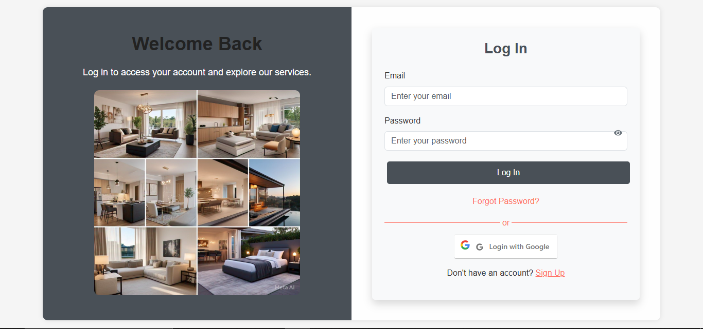
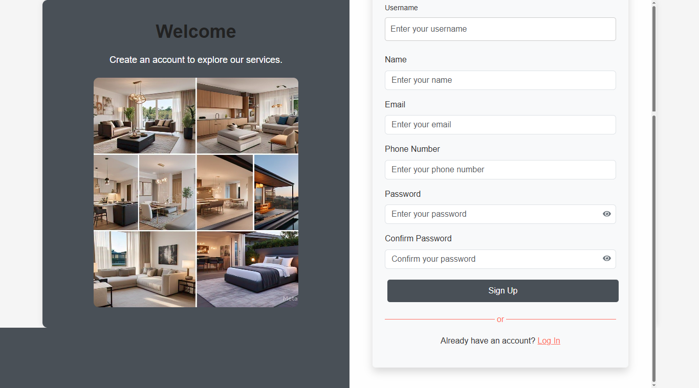

# The Ultimate Platform for Furnished Home Rentals

---

## Project Overview

The **Ultimate Platform for Furnished Home Rentals** is a feature-rich web application designed to simplify the process of finding, booking, and managing furnished homes. Built with the **MERN stack** (MongoDB, Express.js, React.js, Node.js), the platform ensures scalability, speed, and a modern user experience.

Key differentiators include **AI-powered recommendations**, **real-time availability tracking**, **secure payment processing**, and a robust **admin panel** for property management.

---

## Developers

* **Created By:** Asad Bashir & Saqib Mumtaz
* **Lead Developer:** Asad Bashir
  *Asad is a mid-level MERN Stack developer with strong expertise in building scalable web applications. He is currently a 7th-semester Computer Science student at the University of Azad Jammu and Kashmir, aiming to transition into DevOps engineering. Passionate about delivering high-quality code and user-focused solutions.*

---

## Features

### User Features

* **Advanced Search & Filters:** Find homes based on location, budget, amenities, and more.
* **Real-Time Availability:** Prevent double-booking with dynamic property status updates.
* **Secure Booking & Payments:** Integrated Stripe/PayPal for safe transactions.
* **AI Assistant:** Personalized recommendations, rental guidance, and instant support.
* **Favorites List:** Save preferred properties for quick access.
* **User Reviews:** Tenants can rate and review properties post-stay.

### Landlord/Admin Features

* **Property Management:** Add, edit, or remove listings with images, pricing, and amenities.
* **Reservation Management:** View, approve, or cancel bookings.
* **User Management:** Change roles, remove accounts, or view profiles.
* **Contact Messages Handling:** Respond to inquiries directly from the admin panel.

---

## Platform Screenshots & Features Walkthrough

Below are key screenshots from the platform, each illustrating a core feature or interface. Descriptions are provided to guide you through the user and admin experience.

1. **Login Page**  
   The entry point for all users. Secure authentication ensures only registered users can access the platform.
   
   

2. **Signup Page**  
   New users can quickly register by providing essential details, enabling access to all platform features.
   
   

3. **Home Page**  
   The main landing page after login or signup. Here, users are greeted with featured listings, search options, and quick access to platform highlights, making it easy to start exploring available furnished homes.
   
   

4. **Chat Assistant - Developer Info**  
   The AI-powered chat assistant introduces itself and provides information about the development team and platform capabilities.
   
   

5. **Chat Assistant - Feature Info**  
   Users can interact with the chat assistant to learn about platform features, get recommendations, and receive instant support.
   
   

6. **New Properties with Chat Assistant**  
   The chat assistant helps users discover new property listings, making the search process more interactive and efficient.
   
   

7. **Featured Properties Page**  
   Highlights premium and recommended properties, allowing users to quickly find top-rated furnished homes.
   
   

8. **Contact Us Page**  
   Users can reach out for support, inquiries, or feedback directly through this dedicated contact interface.
   
   

9. **Admin Dashboard**  
   The central hub for administrators, providing an overview of platform activity, quick stats, and navigation to management tools.
   
   

10. **Manage Users Page**  
    Admins can view, edit, or remove user accounts, assign roles, and monitor user activity for security and support.
    
    

11. **List Items (Manage Items)**  
    Landlords and admins can add, edit, or remove property listings, including images, pricing, and amenities.
    
    

12. **Listed Properties View**  
    Displays all properties currently listed on the platform, with options to filter, sort, and manage each listing.
    
    

13. **Single Property View (Listed Item)**  
    Detailed view of a single property, showcasing images, amenities, pricing, and booking options.
    
    

14. **All Reservations Page**  
    Admins and landlords can review all bookings, approve or cancel reservations, and monitor occupancy status.
    
    

15. **Contact Messages Panel**  
    Centralized panel for managing user inquiries and messages, enabling prompt responses and efficient communication.
    
    

---

## Tools & Technologies

* **Frontend:** React.js
* **Backend:** Node.js, Express.js
* **Database:** MongoDB
* **AI/ML:** TensorFlow\.js, NLP tools
* **Payments:** Stripe, PayPal
* **Admin Panel Framework:** AdminBro or similar React-based framework

---

## Installation & Setup

```bash
# Clone repository
git clone <repo-url>

# Navigate to project folder
cd furnished-home-rental

# Install dependencies
npm install

# Set environment variables in .env file
MONGO_URI=your_mongodb_connection_string
STRIPE_SECRET_KEY=your_stripe_secret_key
PAYPAL_CLIENT_ID=your_paypal_client_id

# Start development server
npm run dev
```

---

## Usage

1. **Sign up or log in** to the platform.
2. **Search and filter** furnished homes according to your needs.
3. **View property details** and check availability.
4. **Book a property** securely.
5. **Manage your reservations** and view booking history.
6. **Interact with the AI Assistant** for support and recommendations.

---

## License

This project is for academic and demonstration purposes as part of the Undergraduate Final Year Project at the **University of Azad Jammu and Kashmir, Department of Computer Science & Information Technology**.

---

## Contact

For more details, please reach out via the **Contact Us** page within the platform.
